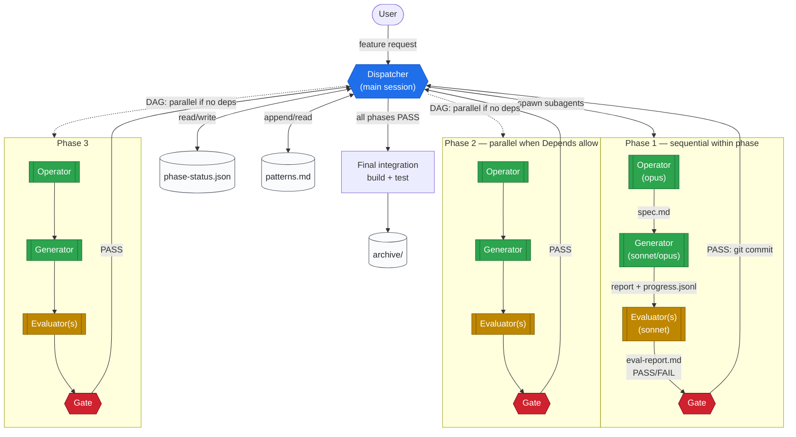

# phase-harness

Multi-phase development harness for Claude Code.

All roles (Operator, Generator, Evaluator) run as isolated subagents so the
main session (Dispatcher) stays thin. This keeps context usage low and
enables large, multi-layer features (DB → API → UI → tests) to be built in
a single run without exhausting the context window.

See [SKILL.md](SKILL.md) for the full specification.

## Architecture



The **Dispatcher** (main session) never reads source code. It only
reads `phase-status.json` and the *verdict* line of eval reports.
Every role (Operator, Generator, Evaluator) runs as a fresh
**subagent** with isolated context. Phases whose `Depends` lists are
satisfied run in parallel; within a phase the three roles run
sequentially through a verification gate.

## When to use

- Feature spans 3+ distinct implementation steps
- Task touches multiple layers (backend + frontend + infra + tests)
- A single-loop harness would likely exceed 10 iterations
- Context exhaustion has been a problem with prior attempts

## When NOT to use

- 1–2 phase work — use a single-loop harness or direct implementation
- Requirements are unclear / exploratory — do a short spike first
- Urgent bug fix — direct implementation is faster
- Cost-sensitive environments — this spawns many subagents

## Key features

- **Full context isolation** — Operator, Generator, Evaluator all run as
  subagents. The main session only reads status JSON.
- **DAG-based parallel phases** — independent phases run in parallel via
  simultaneous subagent invocations.
- **Domain-specialized subagents** — abstract `Domain` labels route to
  language/role specialists (Python-pro, frontend-developer, etc.). Falls
  back to `general-purpose` transparently when specialists aren't available.
- **Cost tiers per phase** — `minimal` / `standard` / `maximum` chooses
  the model mix so simple phases are cheap and critical phases use the
  strongest model.
- **Multi-evaluator consensus** — `criticality: high` phases require
  multiple Evaluators (e.g., domain reviewer + security reviewer) to
  all PASS.
- **Evaluator checklist injection** — security / performance / compatibility
  checklists auto-injected based on phase content.
- **Forward-preferred with bounded retrofit** — verification gates prevent
  rollback. When unavoidable, a `retrofit_request` is logged for user
  approval instead of silent rewrites.
- **Learning accumulation** — `patterns.md` and module-level `CLAUDE.md`
  files are appended by Evaluator on PASS. Periodic distillation prevents
  bloat.
- **Progress streaming** — Generators append JSONL milestones so the user
  can ask for status without waiting for the phase to complete.

## Install

```bash
# User-level (all projects)
cp -r skills/phase-harness ~/.claude/skills/

# Or project-level
mkdir -p .claude/skills
cp -r /path/to/claude-skills/skills/phase-harness .claude/skills/
```

## Optional: personal overrides

Map the skill's abstract `Domain` labels to your environment's concrete
subagent types by adding a rules file:

```bash
cp /path/to/claude-skills/rules-examples/phase-harness.md \
   ~/.claude/rules/phase-harness.md
# edit to reflect your actual subagent names
```

Without this, all phases fall back to `general-purpose` subagents —
still functional but without domain-specialized quality gains.

## Example

See [examples/phase-harness/](../../examples/phase-harness/) for a
filled-in `phase-plan.md` demonstrating DB schema → auth service →
frontend → E2E tests phases.

## Slash commands

During a harness run, the Dispatcher recognizes:

- `status phase-harness` — progress summary from status.json + progress.jsonl
- `pause phase-harness` — stop before the next phase
- `resume phase-harness` — continue from a pause
- `archive phase-harness` — move completed run to `.harness/archive/`
- `help phase-harness` — state-aware guidance

## License

MIT — see the repo root LICENSE.
